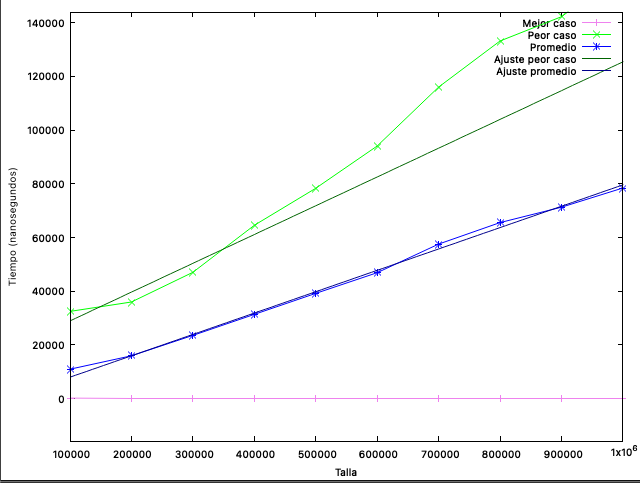

# Práctica 2 - Complejidad
### Index

**[Parte 1 - Mejorar el coste de un algoritmo](#parte-1---mejorar-el-coste-de-un-algoritmo)**
- [1.1 Búsqueda lineal en una matriz](#11-búsqueda-lineal-en-una-matriz)
	- [Pregunta 1.1.1 ¿Cuál es el coste temporal del algoritmo para los casos mejor y peor?](#pregunta-111-cuál-es-el-coste-temporal-del-algoritmo-para-los-casos-mejor-y-peor-justifícalo-mediante-el-número-de-iteraciones)
	- [Pregunta 1.1.2 Iteraciones en matriz 50x50 sin encontrar el elemento](#pregunta-112-si-la-matriz-es-de-tamaño-50x50-y-el-elemento-no-se-encuentra-en-ella-cuántas-iteraciones-realiza-el-algoritmo-demuéstralo-también-contando-iteraciones)
- [1.2 Búsqueda lineal exitosa en la matriz](#12-búsqueda-lineal-exitosa-en-la-matriz)
	- [Pregunta 1.2.1 Coste temporal mejor y peor caso](#pregunta-121-cuál-es-el-coste-temporal-del-algoritmo-para-los-casos-mejor-y-peor-justifícalo-mediante-el-número-de-iteraciones)
	- [Pregunta 1.2.2 Mejora en el caso promedio](#pregunta-121-en-el-caso-del-valor-promedio-ha-mejorado-respecto-al-algoritmo-anterior-justifícalo)
- [1.3 Búsqueda binaria en una matriz](#13-búsqueda-binaria-en-una-matriz)
	- [Pregunta 1.3.1 Mejor y peor caso respecto al coste temporal](#pregunta-131-para-este-algoritmo-existe-caso-mejor-y-caso-peor-respecto-al-coste-temporal-explica-tu-respuesta-y-compara-con-los-resultados-de-los-algoritmos-anteriores)
	- [Pregunta 1.3.2 Iteraciones si el elemento está en el centro](#pregunta-132-si-la-matriz-es-de-tamaño-50x50-y-el-elemento-se-encuentra-en-el-centro-cuántas-iteraciones-realiza-el-algorimo-demuéstralo-con-un-ejemplo-en-el-código)
	- [Pregunta 1.3.3 Iteraciones si el elemento no está](#pregunta-133-si-la-matriz-es-de-tamaño-50x50-y-el-elemento-no-encuentra-en-ella-cuántas-iteraciones-realiza-el-algoritmo-demuéstralo-con-ejemplo-en-el-código)
- [1.4 Búsqueda binaria recursiva en una matriz](#14-búsqueda-binaria-recursiva-en-una-matriz)
	- [Pregunta 1.4.1 Comparación de casos con la versión iterativa](#pregunta-141-para-este-algoritmo-compara-los-resultados-obtenidos-de-caso-mejor-caso-peor-y-caso-promedio-con-el-algoritmo-anterior-en-qué-se-diferencia)
	- [Pregunta 1.4.2 ¿Qué ocurre con matrices grandes?](#pregunta-142-qué-ocurriría-si-empleamos-matrices-mucho-más-grandes-compruébalo)

**[Parte 2 - Calcular coste temporal para tallas grandes](#parte-2---calcular-coste-temporal-para-tallas-grandes)**
- [2.1 Implementando la búsqueda lineal exitosa](#21-implementando-la-búsqueda-lineal-exitosa)
- [2.2 Toma de tiempos y verificación empírica](#22-toma-de-tiempos-y-verificación-empírica)
- [2.3 Comandos para Gnuplot](#23-comandos-para-gnuplot)

## Parte 1 - Mejorar el coste de un algoritmo
### 1.1 Búsqueda lineal en una matriz

```java
public static int[] linearMatSearch(int[][] mat, int valor) {
	int counter = 0;
	int[] result = { -1, 1, counter};
	int x = mat.length; //columnas
	int y = mat[0].length; //filas
	
	for (int i = 0; i < x; i++) {
		for (int j = 0; j < y; j++) {
			counter++;
			if (mat[i][j] == valor) {
				result[0] = i;
				result[1] = j;
			}
		}
	}
	
	result[2] = counter;
	
	return result;
}
```

#### **Pregunta 1.1.1 ¿Cuál es el coste temporal del algoritmo para los casos mejor y peor? Justifícalo mediante el número de iteraciones.**

El coste temporal del algoritmo es de O(m * n) siendo m el número de filas, y n el numero de columnas (o las variables `x` y `y` en codigo).

Si ejecutamos el código, podemos ver como el mejor caso es de O(1), si la matriz es de dimension 1x1.

```
Descripcion			Talla	Iteraciones	Resultado
---------------------------------------------------------
linearMatSearch		1		1			[-1,1]
linearMatSearch		6		6			[-1,1]
linearMatSearch		11		11			[-1,1]
linearMatSearch		16		16			[-1,1]
linearMatSearch		21		21			[-1,1]
linearMatSearch		26		26			[-1,1]
linearMatSearch		31		31			[-1,1]
linearMatSearch		36		36			[-1,1]
linearMatSearch		41		41			[-1,1]
linearMatSearch		30		30			[0,3]
linearMatSearch		126		126			[0,17]
```
#### **Pregunta 1.1.2 Si la matriz es de tamaño 50x50, y el elemento no se encuentra en ella, ¿cuántas iteraciones realiza el algoritmo? Demuéstralo también contando iteraciones.**

El algoritmo realizara 2500, ya que es una matriz 50x50 que son 2500 elementos, y la función itera por todos los elementos.

---

### 1.2 Búsqueda lineal exitosa en la matriz

```java
public static int[] successfulMatSearch(int[][] mat, int valor) {
	int counter = 0;
	int[] result = { -1, 1, counter};
	int x = mat.length; //filas
	int y = mat[0].length; //columnas
	
	for (int i = 0; i < x; i++) {
		for (int j = 0; j < y; j++) {
			counter++;
			if (mat[i][j] == valor) {
				result[0] = i;
				result[1] = j;
				result[2] = counter;
				return result;
			}
		}
	}
	
	result[2] = counter;
	
	return result;
}
```

#### **Pregunta 1.2.1 ¿Cuál es el coste temporal del algoritmo para los casos mejor y peor? Justifícalo mediante el número de iteraciones.**
El coste temporal del algoritmo para el mejor caso es de O(1), y el peor caso es de O(m*n), ya que el mejor caso, es que la matriz sea 1x1 o que el resultado esté en el index [0,0], y el peor caso es que tengamos que recorrer toda la matriz porque el resultado o no está, o está el último.

#### **Pregunta 1.2.1 ¿En el caso del valor promedio, ha mejorado respecto al algoritmo anterior? Justifícalo.**

Sí, ya que en algoritmo anterior teniamos que pasar por todos los elementos si o si, y ahora como hay algunos que devolvemos el resultado antes, la media ahora és de O((m*n)/2), ya que tanto es igual de probable devolver tanto en la primera iteración que en la última.

Y lo podemos ver si hacemos un test:
```
Descripcion			Talla	Iteraciones	Resultado
---------------------------------------------------------
successfulMatSearch	25		1			[0,0]
successfulMatSearch	25		2			[0,1]
successfulMatSearch	25		3			[0,2]
successfulMatSearch	25		4			[0,3]
successfulMatSearch	25		5			[0,4]
successfulMatSearch	25		6			[1,0]
successfulMatSearch	25		7			[1,1]
successfulMatSearch	25		8			[1,2]
successfulMatSearch	25		9			[1,3]
successfulMatSearch	25		10			[1,4]
successfulMatSearch	25		11			[2,0]
successfulMatSearch	25		12			[2,1]
successfulMatSearch	25		13			[2,2]
successfulMatSearch	25		14			[2,3]
successfulMatSearch	25		15			[2,4]
successfulMatSearch	25		16			[3,0]
successfulMatSearch	25		17			[3,1]
successfulMatSearch	25		18			[3,2]
successfulMatSearch	25		19			[3,3]
successfulMatSearch	25		20			[3,4]
successfulMatSearch	25		21			[4,0]
successfulMatSearch	25		22			[4,1]
successfulMatSearch	25		23			[4,2]
successfulMatSearch	25		24			[4,3]
successfulMatSearch	25		25			[4,4]
---------------------------------------------------------
successfulMatSearch Promedio:	13
```

---
### 1.3 Búsqueda binaria en una matriz
```java
public static int[] binaryMatSearch(int[][] matrix, int target) {
	int x = matrix.length; //filas
	int y = matrix[0].length; //columnas
	int counter = 0;
	int index = 0;
	int lastIndex = (x * y) - 1;
	while (counter <= lastIndex) {
		index++;
		int mid = counter + (lastIndex - counter) / 2;
		int[] coordinates = getCoordinates(mid, y);
		int midValue = matrix[coordinates[0]][coordinates[1]];
		if (midValue == target) {
			return new int[] { coordinates[0], coordinates[1], index };
		}
		if (midValue < target) {
			counter = mid + 1;
		} else {
			lastIndex = mid - 1;
		}
	}
	return new int[] {-1, -1, index};
}

public static int[] getCoordinates(int index, int width) {
	int[] coordinates = new int[2];
	coordinates[0] = index / width; // fila
	coordinates[1] = index % width; // columna
	return coordinates;
}
```

#### **Pregunta 1.3.1 Para este algoritmo, ¿existe caso mejor y caso peor respecto al coste temporal? Explica tu respuesta y compara con los resultados de los algoritmos anteriores.**

Sí, ya que te sigue podiendo devolver el resultado en la primera iteración, con el mejor caso siendo O(1), pero el peor caso pasa a ser O(log2(m*n)). Podemos ver que con una talla de 2500, que con el primer algoritmo, siempre tardaba 2500 iteraciones, con el anterior una media de 1250, y ahora con este la media de iteraciones es de solo 10.

#### **Pregunta 1.3.2 Si la matriz es de tamaño 50x50, y el elemento se encuentra en el centro, ¿cuántas iteraciones realiza el algorimo? Demuéstralo con un ejemplo en el código.**

Si ejecutamos la prueba encontrada en el main, con un tamaño de 50x50, podemos ver que el elemento del centro se encuentra en la posición 25,25 y tendremos que realizar 11 iteraciones. 

#### **Pregunta 1.3.3 Si la matriz es de tamaño 50x50, y el elemento no encuentra en ella, ¿cuántas iteraciones realiza el algoritmo? Demuéstralo con ejemplo en el código.**

Este seria el peor caso, y seran 12 iteraciones.

### 1.4 Búsqueda binaria recursiva en una matriz
```java
public static int[] binaryMatRecursiveSearch(int[][] mat, int target, int inicio, int fin) {
	return binaryMatRecursiveSearchHelper(mat, target, inicio, fin, 1);
}

private static int[] binaryMatRecursiveSearchHelper(int[][] mat, int target, int inicio, int fin, int count) {
	if (inicio <= fin) {
		int mid = inicio + (fin - inicio) / 2;
		int[] coordinates = getCoordinates(mid, mat[0].length);

		if (mat[coordinates[0]][coordinates[1]] == target) {
			return new int[] { coordinates[0], coordinates[1], count };
		}
		if (mat[coordinates[0]][coordinates[1]] < target) {
			return binaryMatRecursiveSearchHelper(mat, target, mid + 1, fin, count + 1);
		} else {
			return binaryMatRecursiveSearchHelper(mat, target, inicio, mid - 1, count + 1);
		}
	}
	return new int[] { -1, -1, count - 1 };
}
```

#### **Pregunta 1.4.1 Para este algoritmo, Compara los resultados obtenidos de caso mejor, caso peor y caso promedio con el algoritmo anterior. ¿En qué se diferencia?**

En nada, en la implementación recursiva contra la iterativa.

#### **Pregunta 1.4.2 ¿Qué ocurriría si empleamos matrices mucho más grandes? Compruébalo.**

Podria haber stack overflow, si consume toda la memoria disponible, pero con este algoritmo concreto al ser de O(log2(m*n)) y con la ram de mi ordenador no lo he conseguido.

## Parte 2 - Calcular coste temporal para tallas grandes

### 2.1 Implementando la búsqueda lineal exitosa

> [!NOTE]
> Es una version modificada de la dada en el documento.

Implementamos el siguiente algoritmo:
```java
public static int[] linealSearchIterative(int[] arr, int valor) {
	int pos = -1;
	int iterations = 0;
	for (int i = 0; i < arr.length; i++) {
		iterations++;
		if (arr[i] == valor) {
			return new int[] {pos, iterations};
		}
	}
	return new int[] {pos, iterations};
}
```

### 2.2 Toma de tiempos y verificación empírica

Usamos el siguiente codigo para testear el algoritmo y guardar los resultados en [output.csv](./output.csv).

```java
public static void testArrays() {
	PrintStream csvPrintStream = null;
	try {
			csvPrintStream = new PrintStream(new FileOutputStream("output.csv"));
	} catch (Exception e) {
		System.err.println("Error: No se pudo abrir archivo CSV" + e);
	}
	System.out.printf("%10s;%10s;%10s;%10s\n", "Talla", "Mejor", "Peor", "Promedio");
	csvPrintStream.printf("%10s,%10s,%10s,%10s\n", "Talla", "Mejor", "Peor", "Promedio");
	int[] array;
	int arraySize, vBest, vWorst;
	long timeStart, timeEnd, tBest, tWorst, tAvr;
	
	for (int size=INIT_SIZE;size<=MAX_SIZE;size+=STEP) {
		array =ArraySearch. generateOrderedArray(size);
		arraySize = array.length;
		vBest = array[0];
		vWorst = array[arraySize - 1];
		
		timeStart = System.nanoTime();
		for (int rep=0; rep<REPS; rep++) {
			ArraySearch.linealSearchIterative(array, vBest);
		}
		timeEnd = System.nanoTime();
		tBest = (timeEnd-timeStart)/REPS;
		
		timeStart = System.nanoTime();
		for (int rep=0; rep<REPS; rep++) {
			ArraySearch.linealSearchIterative(array, vWorst);
		}
		timeEnd = System.nanoTime();
		tWorst = (timeEnd-timeStart)/REPS;
		
		timeStart = System.nanoTime();
		for (int rep=0; rep<REPS; rep++) {
			ArraySearch.linealSearchIterative(array, array[arraySize/2]);
		}
		timeEnd = System.nanoTime();
		tAvr  = (timeEnd-timeStart)/REPS;

		System.out.printf("%10d;%10d;%10d;%10d\n", size, tBest, tWorst, tAvr);
		csvPrintStream.printf("%10d,%10d,%10d,%10d\n", size, tBest, tWorst, tAvr);
	}
	csvPrintStream.close();
}
```

Usamos PrintStream para guardar los resultados, tenemos que pensar en cerrar el PrintStream al acabar de guardar los resultados.

### 2.3 Comandos para Gnuplot

Con los datos obtenidos, y guardados en [output.csv](./output.csv) ejecutamos los siguientes comandos para crear la grafica.



```gnuplot
# Usar coma como separador
set datafile separator ","

# Definir funciones lineales
f(x) = a*x + b       # Para el peor caso
g(x) = c*x + d       # Para el promedio

# Ajustar la función f(x) a los datos de la columna 3 (peor caso)
fit f(x) "output.csv" using 1:3 via a, b

# Ajustar la función g(x) a los datos de la columna 4 (promedio)
fit g(x) "output.csv" using 1:4 via c, d

# Etiquetas de los ejes
set xlabel "Talla"
set ylabel "Tiempo (nanosegundos)"

# Dibujar gráfico con funciones ajustadas y datos
plot "output.csv" using 1:2 title "Mejor caso" with linespoints lc rgb "violet",  "output.csv" using 1:3 title "Peor caso" with linespoints lc rgb "green", "output.csv" using 1:4 title "Promedio" with linespoints lc rgb "blue", f(x) title "Ajuste peor caso" with lines lc rgb "dark-green", g(x) title "Ajuste promedio" with lines lc rgb "dark-blue"

```

O con el archivo [plot_commands.gnu](./plot_commands.gnu).

